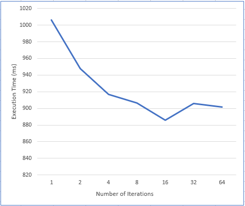
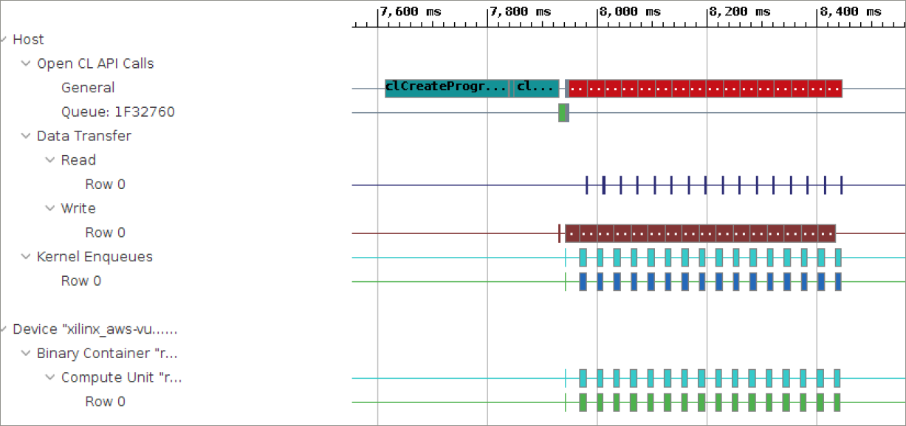
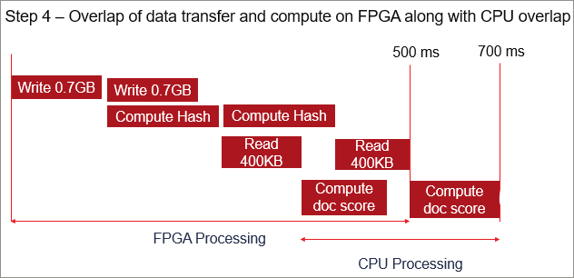

# Part 2: Data Movement Between the Host and Kernel

## Step 1: Naive Approach

The initial version of the accelerated application follows the structure of original software version. We are transferring the entire input buffer from the host to the FPGA in one iteration followed by compute and reading the output from the FPGA to the host. The following figure shows the read-compute-write pattern in this step

  

The FPGA kernel code is already given, which computes the hash values for words in the document and returns back to the host.

The input arguments to the kernel are as follows:

* `input_doc_words`: Input array which contains the 32-bit words for all the documents.
* `bloom_filter`: Bloom filter array which contains the inserted hash values of search array.
* `total_size`: Unsigned int which represents the total size processed by the FPGA when it is called.
* `load_weights`: Boolean which allows to load the `bloom_filter` array only once to the FPGA in the case of multiple kernel invocations.

The output of the kernel is as follows:

* `output_inh_flags`: Output array of 8-bit outputs where each bit in the 8-bit output indicates whether a word is present in the bloom filter which is then used for computing score in the CPU.

### Run the Application

1. Go to the `makefile` directory and run the make command.

```
cd /home/centos/src/project_data/SDAccel-AWS-F1-Developer-Labs/modules/module_01/makefile
sudo -E -- bash -c 'make run STEP=single_buffer SOLUTION=1'
```

2. The output is as follows.

```
--------------------------------------------------------------------
 Executed FPGA accelerated version  |  1030.6703 ms   ( FPGA 616.349 ms )
 Executed Software-Only version     |  3694.6240 ms
--------------------------------------------------------------------
 Verification: PASS
```

### Profile Summary Analysis

1. Change your working directory to `/home/centos/src/project_data/SDAccel-AWS-F1-Developer-                m     Labs/modules/module_01/build/single_buffer`.

   ```
   cd /home/centos/src/project_data/SDAccel-AWS-F1-Developer-Labs/modules/module_01/build/single_buffer
   ```
   

2. Run the following command to look at the Profile Summary Report.

   ```
   sdx_analyze  profile  -f html -i ./profile_summary.csv
   firefox profile_summary.html
   ```

*  Looking at the *Kernel Execution* section in the report, we see the kernel execution time as 175.286 ms.

*  The theoretical number expected from the kernel running at 250MHZ clock and processing eight words in parallel is as follows:

   Number of words/(Clock freq * Parallelization factor in Kernel) =    401022976/(250\*1000000\*8) = 174.86 ms

   As you can see, the compute time of kernel closely matches with the theoretical number. 
    

### Timeline Trace Analysis

1. Run the following commands to view the Timeline Trace report.

  ```
  sdx_analyze trace -f wdb -i ./timeline_trace.csv
  sdx -workspace workspace -report timeline_trace.wdb
  ```

2. Zoom in to display the timeline trace report as follows:


As expected, there is a sequential execution of operations starting from the data transferred from the host to the FPGA, followed by compute in the FPGA and transferring back the results from the FPGA to host.

### Conclusion

From the above Profile Summary and Timeline Trace reports, you see that the kernel execution time closely matches with the expected theoretical number. There is sequential execution with the data transfers between the FPGA and host and compute in the FPGA. To further improve performance, you can look into overlapping data transfers and compute.

## Step 2: Overlapping Data Transfer and Compute

In the previous step, you noticed a sequential execution of the read, compute, and write (that is, the compute does not start until the entire input is read into the FPGA and similarly, the host read from the FPGA does not start until compute is done).

To improve the performance, you can send the input buffer in multiple iterations and start the compute for the corresponding iteration as soon as the data for the iteration is transferred.  Because the compute of each iteration is independent of the other iterations, you can overlap the data transfer of the next iteration and compute of the current iteration. The performance is expected to increase, because instead of the sequential execution of the data transfer and compute, you are now overlapping the data transfer and compute. The following figure shows an illustrated representation of sending data as a whole, versus sending it in two buffers.

   

### Host Code Modifications
  
1. Change your working directory to `/home/centos/src/project_data/SDAccel-AWS-F1-Developer-Labs/modules/module_01/reference_files`.

2. Open `run_split_buffer.cpp` file with a file editor.

3. The lines 64-144 are modified to optimize the host code to send the input buffer in two iterations to enable overlapping of data        transfer an compute. It is explained in detail as follows

  
  a.   The two sub buffers for "input_doc_words" & "output_inh_flags" are created as follows:

        // Make buffers resident in the device
        q.enqueueMigrateMemObjects({buffer_bloom_filter, buffer_input_doc_words, buffer_output_inh_flags}, CL_MIGRATE_MEM_OBJECT_CONTENT_UNDEFINED);
 
        // Create sub-buffers, one for each transaction 
        unsigned subbuf_doc_sz = total_doc_size/2;
        unsigned subbuf_inh_sz = total_doc_size/2;
 
        cl_buffer_region subbuf_inh_info[2];
        cl_buffer_region subbuf_doc_info[2];
 
        cl::Buffer subbuf_inh_flags[2];
        cl::Buffer subbuf_doc_words[2];
 
 
        subbuf_inh_info[0]={0, subbuf_inh_sz*sizeof(char)};
        subbuf_inh_info[1]={subbuf_inh_sz*sizeof(char), subbuf_inh_sz*sizeof(char)};
        subbuf_doc_info[0]={0, subbuf_doc_sz*sizeof(uint)};
        subbuf_doc_info[1]={subbuf_doc_sz*sizeof(uint), subbuf_doc_sz*sizeof(uint)};
        subbuf_inh_flags[0] = buffer_output_inh_flags.createSubBuffer(CL_MEM_WRITE_ONLY, CL_BUFFER_CREATE_TYPE_REGION, &subbuf_inh_info[0]);
        subbuf_inh_flags[1] = buffer_output_inh_flags.createSubBuffer(CL_MEM_WRITE_ONLY, CL_BUFFER_CREATE_TYPE_REGION, &subbuf_inh_info[1]);
        subbuf_doc_words[0] = buffer_input_doc_words.createSubBuffer (CL_MEM_READ_ONLY,  CL_BUFFER_CREATE_TYPE_REGION, &subbuf_doc_info[0]);
        subbuf_doc_words[1] = buffer_input_doc_words.createSubBuffer (CL_MEM_READ_ONLY,  CL_BUFFER_CREATE_TYPE_REGION, &subbuf_doc_info[1]);
 
        printf("\n");
        double mbytes_total  = (double)(total_doc_size * sizeof(int)) / (double)(1000*1000);
        double mbytes_block  = mbytes_total / 2;
        printf(" Processing %.3f MBytes of data\n", mbytes_total);
        printf(" Splitting data in 2 sub-buffers of %.3f MBytes for FPGA processing\n", mbytes_block);
 
  b. Vector of events are created to coordinate the read, compute, and write operations such that each iteration is independent of          other iteration, which allows for overlap between the data transfer and compute.
  
        // Events 
        vector<cl::Event> wordWait;
        vector<cl::Event> krnlWait;
        vector<cl::Event> flagWait;
 
        printf("--------------------------------------------------------------------\n");
 
        chrono::high_resolution_clock::time_point t1, t2;
        t1 = chrono::high_resolution_clock::now();
 
   c. Kernel arguments are set and kernel is enqueued to load the bloom filter coeffecients
   
        // Only load the bloom filter in the kernel
        cl::Event buffDone,krnlDone,flagDone;
        total_size = 0;
        load_filter = true;
        kernel.setArg(3, total_size);
        kernel.setArg(4, load_filter);
        q.enqueueMigrateMemObjects({buffer_bloom_filter}, 0, NULL, &buffDone);
        wordWait.push_back(buffDone);
        q.enqueueTask(kernel, &wordWait, &krnlDone);
        krnlWait.push_back(krnlDone);
        
        
   d. Kernel arguments are set , input buffer is transferred from host to FPGA , kernel is enqueued and the output is read from FPGA to       host for processing the first iteration.   
 
        // Now start processing the documents in chunks
        // The FPGA kernel computes the in-hash flags for each word in the sub-buffer
 
                total_size = total_doc_size/2;
                load_filter=false;
                kernel.setArg(3, total_size);
                kernel.setArg(4, load_filter);
 
         //    Start kernel for transaction 1
                kernel.setArg(0, subbuf_inh_flags[0]);
                kernel.setArg(1, subbuf_doc_words[0]);
                q.enqueueMigrateMemObjects({subbuf_doc_words[0]}, 0, &wordWait, &buffDone);
                wordWait.push_back(buffDone);
                q.enqueueTask(kernel, &wordWait, &krnlDone);
                krnlWait.push_back(krnlDone);
                q.enqueueMigrateMemObjects({subbuf_inh_flags[0]}, CL_MIGRATE_MEM_OBJECT_HOST, &krnlWait, &flagDone);
                flagWait.push_back(flagDone);
 
   e.  Kernel arguments are set , input buffer is transferred from host to FPGA , kernel is enqueued and the output is read from FPGA          to host for processing the second iteration  
       
         //    Start kernel for transaction 2
                kernel.setArg(0, subbuf_inh_flags[1]);
                kernel.setArg(1, subbuf_doc_words[1]);
                q.enqueueMigrateMemObjects({subbuf_doc_words[1]}, 0, &wordWait, &buffDone);
                wordWait.push_back(buffDone);
                q.enqueueTask(kernel, &wordWait, &krnlDone);
                krnlWait.push_back(krnlDone);
                q.enqueueMigrateMemObjects({subbuf_inh_flags[1]}, CL_MIGRATE_MEM_OBJECT_HOST, &krnlWait, &flagDone);
                flagWait.push_back(flagDone);
 
   f. The host is blocked until the output is read from FPGA to host.
   
        // Wait until all results are copied back to the host before doing the post-processing
                flagWait[0].wait();
                flagWait[1].wait();
  


### Run the Application

1. Go to the `makefile` directory and run the `make` command.

```
cd /home/centos/src/project_data/SDAccel-AWS-F1-Developer-Labs/modules/module_01/makefile
sudo -E -- bash -c 'make run STEP=split_buffer SOLUTION=1'
```

2. The output is as follows.

```
--------------------------------------------------------------------
 Executed FPGA accelerated version  |   942.3678 ms   ( FPGA 564.939 ms )
 Executed Software-Only version     |   3640.0865 ms
--------------------------------------------------------------------
 Verification: PASS
```

 ### Timeline Trace Analysis

1. Run the following commands to view the Timeline Trace report.

```
sdx_analyze trace -f wdb -i ./timeline_trace.csv
sdx -workspace workspace -report timeline_trace.wdb
```

2. Zoom in to display the timeline trace report as follows:


As you can see from the Timeline Trace report , there is an overlap of the read, compute, and write operations between the first and second iterations, which improves the total execution time on the FPGA.

### Conclusion

  From the above Profile Summary and Timeline Trace reports, you can see that the total execution time on the FPGA improved, as the time spent on theFPGA improved from the previous step due to the overlap between the data transfer and compute.

## Step 3: Overlap of Data Transfer and Compute with Multiple Buffers

In the previous step, you split the input buffer into two sub buffers and overlapped the compute with a data transfer. In this step, you will write a generic code, so the input data is split into multiple iterations to achieve the optimal execution time.

### Host Code Modifications

1. Change your working directory to `/home/centos/src/project_data/SDAccel-AWS-F1-Developer-Labs/modules/module_01/reference_files`.

   ```
   cd /home/centos/src/project_data/SDAccel-AWS-F1-Developer-Labs/modules/module_01/reference_files
   ```

2. Open `run_generic_buffer.cpp` file with a file editor.

3. The lines 67-137 are modified to optimize the host code to send the input buffer in multiple iterations to enable overlapping of        data transfer an compute. It is explained in detail as follows

  
    a. Multiple sub buffers are created for "input_doc_words" & "output_inh_flags" as follows
    
        // Create sub-buffers, one for each transaction 
        unsigned subbuf_doc_sz = total_doc_size/num_iter;
        unsigned subbuf_inh_sz = total_doc_size/num_iter;
 
        cl_buffer_region subbuf_inh_info[num_iter];
        cl_buffer_region subbuf_doc_info[num_iter];
 
        cl::Buffer subbuf_inh_flags[num_iter];
        cl::Buffer subbuf_doc_words[num_iter];
 
        for (int i=0; i<num_iter; i++) {
                subbuf_inh_info[i]={i*subbuf_inh_sz*sizeof(char), subbuf_inh_sz*sizeof(char)};
                subbuf_doc_info[i]={i*subbuf_doc_sz*sizeof(uint), subbuf_doc_sz*sizeof(uint)};
                subbuf_inh_flags[i] = buffer_output_inh_flags.createSubBuffer(CL_MEM_WRITE_ONLY, CL_BUFFER_CREATE_TYPE_REGION, &subbuf_inh_info[i]);
                subbuf_doc_words[i] = buffer_input_doc_words.createSubBuffer (CL_MEM_READ_ONLY,  CL_BUFFER_CREATE_TYPE_REGION, &subbuf_doc_info[i]);
        }
 
        printf("\n");
        double mbytes_total  = (double)(total_doc_size * sizeof(int)) / (double)(1000*1000);
        double mbytes_block  = mbytes_total / num_iter;
        printf(" Processing %.3f MBytes of data\n", mbytes_total);
        if (num_iter>1) {
        printf(" Splitting data in %d sub-buffers of %.3f MBytes for FPGA processing\n", num_iter,mbytes_block);
        }
 
     b. Vector of events are created to coordinate the read, compute, and write operations such that every iteration is independent of         other iterations, which allows for overlap between the data transfer and compute.
     
        // Events 
        vector<cl::Event> wordWait;
        vector<cl::Event> krnlWait;
        vector<cl::Event> flagWait;
 
        printf("--------------------------------------------------------------------\n");
 
        chrono::high_resolution_clock::time_point t1, t2;
        t1 = chrono::high_resolution_clock::now();
        
      c. Kernel arguments are set and the kernel is enqueued to load the bloom filter coeffecients
 
        // Only load the bloom filter in the kernel
        cl::Event buffDone, krnlDone;
        total_size = 0;
        load_filter = true;
        kernel.setArg(3, total_size);
        kernel.setArg(4, load_filter);
        q.enqueueMigrateMemObjects({buffer_bloom_filter}, 0, NULL, &buffDone);
        wordWait.push_back(buffDone);
        q.enqueueTask(kernel, &wordWait, &krnlDone);
        krnlWait.push_back(krnlDone);
 
       
       
      d.  Kernel arguments are set, input buffer is transferred from host to FPGA, kernel is enqueued and the output is read from FPGA           to host for processing the multiple iterations.
      
       // Now start processing the documents in chunks
        // The FPGA kernel computes the in-hash flags for each word in the sub-buffer
        for (int i=0; i<num_iter; i++)
        {
                cl::Event buffDone, krnlDone, flagDone;
                total_size = subbuf_doc_info[i].size / sizeof(uint);
                load_filter = false;
                kernel.setArg(0, subbuf_inh_flags[i]);
                kernel.setArg(1, subbuf_doc_words[i]);
                kernel.setArg(3, total_size);
                kernel.setArg(4, load_filter);
                q.enqueueMigrateMemObjects({subbuf_doc_words[i]}, 0, &wordWait, &buffDone);
                wordWait.push_back(buffDone);
                q.enqueueTask(kernel, &wordWait, &krnlDone);
                krnlWait.push_back(krnlDone);
                q.enqueueMigrateMemObjects({subbuf_inh_flags[i]}, CL_MIGRATE_MEM_OBJECT_HOST, &krnlWait, &flagDone);
                flagWait.push_back(flagDone);
        }
 
     e.  The host is blocked until the output is read from FPGA to host.
     
        // Wait until all results are copied back to the host before doing the post-processing
        for (int i=0; i<num_iter; i++)
        {
                flagWait[i].wait();
        }
        q.finish(); 
 
 The above code is generic enough to split the data into the number of multiple buffers.

### Run the Application
   

1. Go to the `makefile` directory and run the `make` command.
 
    ```
   cd /home/centos/src/project_data/SDAccel-AWS-F1-Developer-Labs/modules/module_01/makefile
   sudo -E -- bash -c 'make run STEP=generic_buffer ITER=16 SOLUTION=1'
    ```
   The argument `ITER` represents the number of iterations of data transfer from host to FPGA.

2. Run the above `make` command with `ITER` values as 1,2,4,8,16,32,64. 

3. Plotting a graph with the execution times of different `ITER` values varying with `ITER` is as follows

    
 
   As we can see from the above graph that 16 iterations seems to give the best performance.
 
 4. The output with `ITER` 16 is as follows.

```
 --------------------------------------------------------------------
 Executed FPGA accelerated version  |   899.2955 ms   ( FPGA 515.489 ms )
 Executed Software-Only version     |   3639.3084 ms
--------------------------------------------------------------------
 Verification: PASS
```

### Timeline Trace Analysis

1. Run the following commands to look at Timeline Trace report.

  ```
  sdx_analyze trace -f wdb -i ./timeline_trace.csv
  sdx -workspace workspace -report timeline_trace.wdb
  ```

2. Zoom in to display the timeline trace report as follows.



As you can see from the report, the input buffer is split into 16 sub buffers, and there are overlaps between read, compute, and write.

### Conclusion

From the above Profile Summary and Timeline Trace reports, you see that the total execution time on the FPGA improved from the previous steps after splitting the input data into multiple buffers, allowing overlap between the data transfer and compute.

## Step 4: Overlap Between the CPU and FPGA

In the previous steps, you have looked at optimizing the execution time of the FPGA by overlapping the data transfer and compute. After the FPGA compute is complete, the CPU computes the document scores based on the output from the FPGA. There is sequential execution between the FPGA processing and CPU post-processing. From the previous timeline trace reports, you can find red segments in *OpenCL API Calls* of the *Host* section indicating that the host is blocked during FPGA processing. In this step, you will overlap the FPGA processing with the CPU post-processing.

Because the total compute is split into multiple iterations, you can start post-processing in the CPU once the corresponding iteration is complete, allowing the overlap between the CPU and FPGA processing. The performance increases because the CPU is also processing in parallel with the FPGA, which reduces the execution time. The following figure illustrates this type of overlap.

   

## Host Code Modifications

1. Change your working directory to `/home/centos/src/project_data/SDAccel-AWS-F1-Developer-Labs/modules/module_01/reference_files`.

   ```
   cd /home/centos/src/project_data/SDAccel-AWS-F1-Developer-Labs/modules/module_01/reference_files
   ```

2. Open `run_sw_overlap.cpp` file with a file editor.

3. The lines 134-171 are modified to optimize the host code such that CPU processing is overlapped with FPGA processing. It is            explained in detail as follows
     
     a. Following variables are created to keep track of the words processed by FPGA 
     
        // Compute the profile score the CPU using the in-hash flags computed on the FPGA
        unsigned int curr_entry;
        unsigned char inh_flags;
        unsigned int  available = 0;
        unsigned int  needed = 0;
        unsigned int  iter = 0;

     b. Block the host only if the hash function of the words are still not computed by FPGA thereby allowing overlap between CPU &             FPGA processing.
     
        for(unsigned int doc=0, n=0; doc<total_num_docs;doc++)
        {
                unsigned long ans = 0;
                unsigned int size = doc_sizes[doc];

       
                // Check if we have enough flags from the FPGA device to process the next doc
                // If not, wait until the next sub-buffer is read back to the host
                // Update the number of available words and sub-buffer count (iter)
                needed += size;
                if (needed > available) {
                        flagWait[iter].wait();
                        available += subbuf_doc_info[iter].size / sizeof(uint);
                        iter++;
                }
        
                for (unsigned i = 0; i < size ; i++, n++)
                {
                        curr_entry = input_doc_words[n];
                        inh_flags  = output_inh_flags[n];
 
 
                         
                       if (inh_flags)
                        {
                                unsigned frequency = curr_entry & 0x00ff;
                                unsigned word_id = curr_entry >> 8;

                                ans += profile_weights[word_id] * (unsigned long)frequency;
                        }
                }
                profile_score[doc] = ans;
        }


### Run the Application

1. Go to the `makefile` directory and run the `make` command.

  ```
  cd /home/centos/src/project_data/SDAccel-AWS-F1-Developer-Labs/modules/module_01/makefile
  sudo -E -- bash -c 'make run STEP=sw_overlap ITER=16 SOLUTION=1'
  ```

2. The output is as follows.

  ```
  --------------------------------------------------------------------
  Executed FPGA accelerated version  |   552.5344 ms   ( FPGA 528.744 ms )
  Executed Software-Only version     |   3864.4070 ms
  --------------------------------------------------------------------
  Verification: PASS
  ```

### Timeline Trace Analysis

1. Run the following commands to view the Timeline Trace report.

 ```
 sdx_analyze trace -f wdb -i ./timeline_trace.csv
 sdx -workspace workspace -report timeline_trace.wdb
 ```

2. Zoom in to display the timeline trace report as follows.


As seen above in *OpenCL API Calls* of the *Host* section with the yellow marking, the red segments are shorter in width indicating that the processing time of the host CPU is now overlapping with FPGA processing, which improved the overall application execution time. In the previous steps, the host was completely blocked until the FPGA processing was complete.

### Conclusion

Congratulations. You have successfully completed the lab!

In this lab, you performed host code optimizations by overlapping data transfers and compute and overlapping CPU processing with FPGA processing. You can see that the performance of the application on the FPGA is 7 times faster than the CPU by performing host code optimizations without any kernel optimizations.
