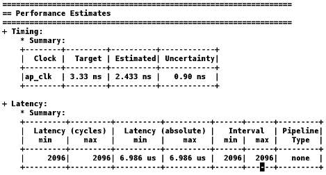
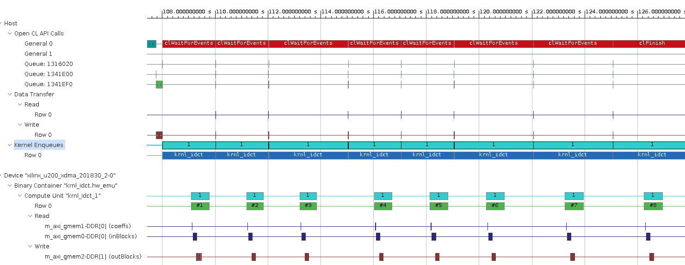

## Application Performance Analysis
In this lab we will have a look at the different types of reports produced by Vitis during emulation and hardware runs and see how we can uses these reports to analyze different performance metrics and identify potential performance improvement. 

**NOTE**: We will use most of the emulation results created by different runs performed in the last lab, if you have not completed this lab please complete it.

### Analyzing the Reports  

This section covers how to locate and read the various reports generated by the emulation runs. The goal of the section is to understand the analysis reports of Vitis before utilizing them in the next section.  

#### Profile Summary report

After the emulation run completes, an profile_summary_hw_emu.csv file is generated in the `build` folder. This file can be opened with Vitis Analyzer.

Open the generated profile summary report as follows:
```
cd ./build/
vitis_analyzer profile_summary_hw_emu.csv
```

  

  This report provides data related to how the application runs. Notice that the report has four tabs at the bottom: **Top Operations**, **Kernels & Compute Units**, **Data Transfers**, and **OpenCL APIs**.

  Click through and inspect each of the tabs:

  * **Top Operations**: Top operations tab provides metrics in terms of completion/execution times for kernel and data transfers between host and the device global memories giving at glance view of any potential performance bottlenecks. This allows you to identify throughput bottlenecks when transferring data or during kernel execution which ever is the slowest. Efficient transfer of data to the kernel/host allows for faster execution times.

  * **Kernels & Compute Units**: Shows the number of times the kernel was executed. Includes the total, minimum, average, and maximum run times. If the design has multiple compute units, it will show each compute unit’s utilization. When accelerating an algorithm, the faster the kernel executes, the higher the throughput which can be achieved. It is best to optimize the kernel to be as fast as it can be with the data it requires. In this table some numbers give key insight into potential for performance improvement. CU unit utilization being small essentially hints that CU was not busy processing data most of the time but waiting for data to arrive from host. Another important number to look for is dataflow acceleration, it tells us about potential for acceleration using dataflow hardware optimization that can be applied to kernel.

  * **Data Transfers**: This tab has no bearing in software emulation as no actual data transfers are emulated across the host to the platform. In hardware emulation, this shows the throughput and bandwidth of the read/writes to the global memory that the host and kernel share. During hardware emulation these number give relatively accurate numbers, but generally hardware emulation is very slow and data set size used are smaller hence these number doesnt reflect very accurate picture We will use these number for analysis in a realistic fashion in next lab while running on hardware where we can experiment with larger data sets.

  * **OpenCL APIs**: Shows all the OpenCL API command executions, how many time each was executed, and how long they take to execute or how much time was spent during which this call was active.

3. Click on the **Kernels & Compute Units** tab of the **Profile Summary** report, locate and note the following numbers:

  - Kernel Total Time (ms):

This number will serve as reference point to compare against after optimization.    

#### HLS reports

The Vitis v++ compiler also generates **HLS Reports** for each kernel. **HLS Reports** explain the results of compiling the kernel into hardware. It contains many details (including clocking, resources or device utilization) about the performance and logic usage of the custom-generated hardware logic. These details provide many insights to guide the kernel optimization process.    

1. Locate the HLS reports:
```
cd $LAB_WORK_DIR/Vitis-AWS-F1-Developer-Labs/modules/module_01/idct/
find . -name "*_csynth.rpt"
```

2. Open the **./build/reports/krnl_idct.hw_emu/hls_reports/krnl_idct_csynth.rpt** file, scroll to the **Performance Estimates** section, locate the **Latency (clock cycles)**  summary table and note the following performance numbers:

  - Latency (min/max):
  - Interval (min/max):
  
  These numbers reported in the table give performance expectation from the kernel in terms of clock cycles and also in time unites. Also from the same table under **Latency-Summary* note the pipeline type it should be "none".


We will utilize hardware optimization namely dataflow in next labs and will come back and compare performance with these numbers..


#### Application Timeline report

In addition to the profile_summary_hw_emu.csv file, the emulation run also generates an timeline_trace_hw_emu.csv file in yhe `build` folder. This file give more details about full application behavior including the interactions and execution times on hardware side(FPGA Card). We can analyze this report for host side application issues and other things like looking at specific data transfer rates, kernel execution times for different enqueues. Essentially a timeline describing application lifetime with annotations for data transfer sizes, transfer times and bandwidth utilization. The timeline also gives even dependencies between different enqueued tasks such memory transfers and kernel execution. 

Open the generated profile summary report generated
```
vitis_analyzer build/timeline_trace_hw_emu.csv 
```




The **Application Timeline** collects and displays host and device events on a common timeline to help you understand and visualize the overall health and performance of your systems. These events include OpenCL API calls from the host code: when they happen and how long each of them takes.
Application Timeline has two distinct sections for **Host** and **Device**.

##### Host Application Timeline
For IDCT application host side essentially manages data allocation, data movements and kernel invocations. It uses multiple OpenCL buffers that have data ready for device to be processes, it uses a pool of these buffers in a circular buffer style. This pool is checked for any buffers which have been used by device and new data is associated with these buffers as soon as possible. The timeline captures this behavior for IDCT application. The dependencies between data transfers and kernel execution are created in a fashion described follows:

  * Data transfers from host to device global memory don't depend on anything and hence they can pretty much complete anytime before kernel execution which can be seen from application timeline
  * Kernel execution/enqueues depend on host to device data transfers and also on any kernel enqueue that was done right before this kernel, so they complete after related transfers and previous kernel enqueues.
  * Transfers from host to device depend on kernel execution so they always complete after kernel enqueue calls done.
  
  All the **stated dependencies** can also be checked by clicking on any enqueue call it will **display arrow connections** which show dependencies as specified by application programmer on host side using **OpenCL APIs** while enqueuing different operations.

##### Device Execution Timeline    
Device side timeline trace gives details of activity happening on the FPGA device or acceleration card. Here you can find actual hardware activity happening for different CUs, for IDCT we are using has only one instance of IDCT kernel so a single CU. All its interfaces to device global memory are traced out. In the case of IDCT it uses three separate interfaces two for co-efficient and input data and one interface for output data.
* Go to device side timeline place the cursor close to first memory transfer or compute you will that even though we have three separate memory interface the transfers are happening sequentially, we will ponder about this phenomenon in latter labs to utilize this potential for performance improvement.
 

### Summary  

In this lab, you learned:
* About different type of reports produced by Vitis
* How to read these reports for important metrics
* How to analyze timeline traces for host and device efficiency and potential improvements


In the next labs you will utilize these analysis capabilities to drive and measure code optimizations both for host and kernel performance improvements.

---------------------------------------

<p align="center"><b>
Start the next lab: <a href="lab_03_idct_optimization.md">Optimizing F1 applications</a>
</b></p>  
 